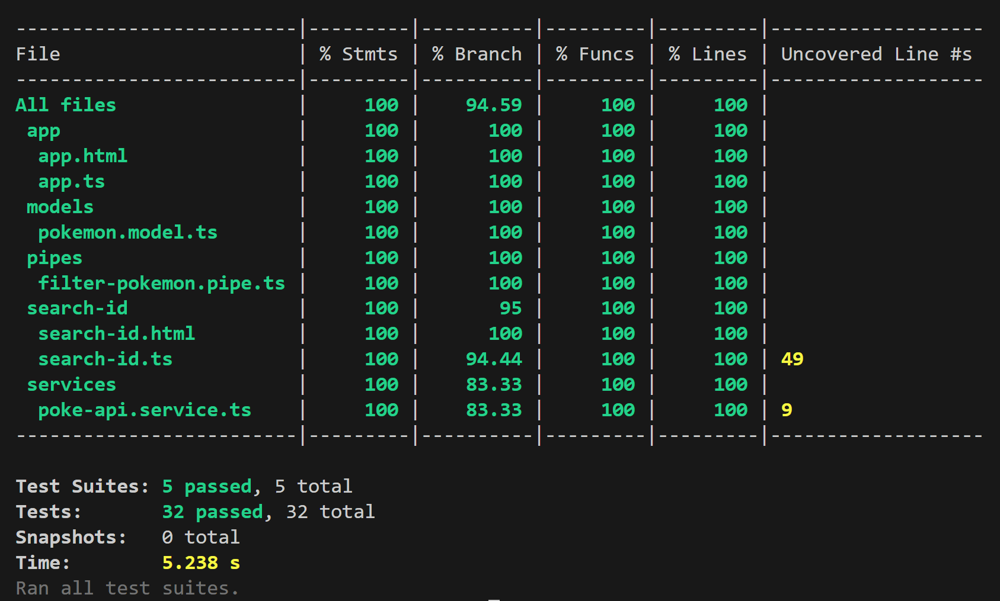
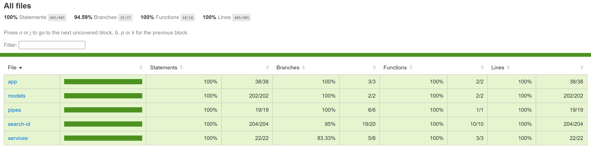
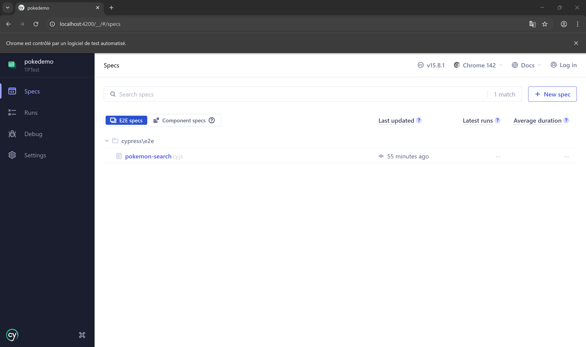
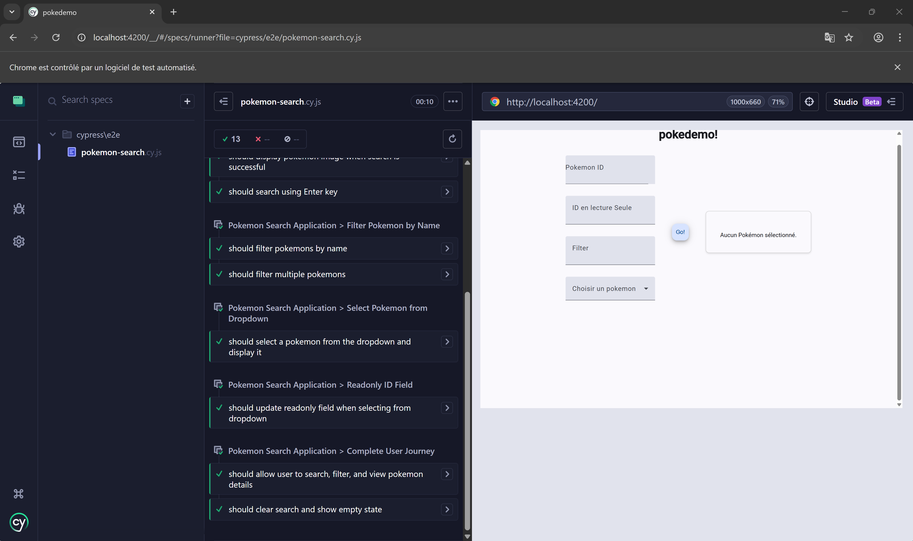

# Pokédex - TP Test Front

**Étudiant :** Gauthier COPPEAUX  
**Formation :** M1 IL CLA1 - Web Engineering  
**Date :** 2 janvier 2026

## Objectif

Mettre en place une stratégie de test complète sur une application Angular :
- Tests unitaires avec Jest (composants, services, pipes, modèles)
- Tests E2E avec Cypress (scénarios utilisateur)

## Résultats des Tests

### Tests Unitaires Jest





**Résultats : 32 tests passés / 100% de couverture (statements, functions, lines)**

### Tests E2E Cypress





**Résultats : 13 tests passés**

---

## Installation et Utilisation

### Prérequis

```bash
node --version  # v20+ recommandé
npm --version   # v10+
```

### Installation

```bash
git clone https://github.com/gauthiercpx/pokedemo.git
cd pokedemo
npm install --legacy-peer-deps
```

### Lancer les tests

**Tests Jest :**
```bash
npm run test              # Exécuter les tests
npm run test:coverage     # Générer le rapport de couverture
npm run test:watch        # Mode watch
```

**Tests E2E Cypress :**
```bash
# Terminal 1
ng serve

# Terminal 2
npm run cypress
```

---

## Structure du Projet

```
pokedemo/
├── src/
│   ├── app/
│   │   ├── app.config.ts              # Configuration standalone
│   │   ├── app/                       # Composant racine
│   │   ├── search-id/                 # Composant recherche
│   │   ├── services/
│   │   │   └── poke-api.service.ts
│   │   ├── pipes/
│   │   │   └── filter-pokemon.pipe.ts
│   │   └── models/
│   │       └── pokemon.model.ts
│   └── main.ts
├── cypress/
│   └── e2e/
│       └── pokemon-search.cy.js       # 6 groupes, 13 tests
├── cypress.config.ts
├── jest.config.ts
└── package.json
```

---

## Tests Détaillés

### Jest (32 tests)

- **app.spec.ts** (1 test) : Composant racine
- **search-id.spec.ts** (16 tests) : Composant recherche, chargement API, filtrage, gestion d'erreur
- **poke-api.service.spec.ts** (1 test) : Service API
- **filter-pokemon.pipe.spec.ts** (8 tests) : Filtrage par propriété, insensibilité casse, cas limites
- **pokemon.model.spec.ts** (6 tests) : Modèle de données

**Couverture :**
```
Statements : 100% (485/485)
Branches   : 94.59% (35/37)
Functions  : 100% (18/18)
Lines      : 100% (485/485)
```

### Cypress (13 tests, 6 groupes)

1. **Application Loading** (3 tests) : Chargement, formulaire, boutons visibles
2. **Search Pokemon by ID** (4 tests) : Recherche Pikachu/Charizard, Enter key, image
3. **Filter Pokemon by Name** (2 tests) : Filtrage temps réel
4. **Select from Dropdown** (1 test) : Sélection Material
5. **Readonly ID Field** (1 test) : Mise à jour du champ
6. **Complete User Journey** (2 tests) : Parcours complet, fermeture

---

## Problèmes Rencontrés et Solutions

| Problème | Solution |
|----------|----------|
| Cypress 404 Not Found | Ajout `baseUrl: 'http://localhost:4200'` dans cypress.config.ts |
| Conflit npm install | Utilisation du flag `--legacy-peer-deps` |
| Warning Jest dépréciation | Mise à jour setup-jest.ts vers `setupZoneTestEnv()` |

---

## Points Clés

- Architecture Angular 21 standalone sans NgModule traditionnel
- 100% de couverture de code en tests unitaires
- Tests E2E couvrant tous les parcours utilisateur
- Sélecteurs Cypress robustes (classes Material CSS)
- Gestion des erreurs API testée

---

## Ressources

- [Sujet du TP Test Front - Cypress](https://hackmd.diverse-team.fr/s/ryBOx3Jfye#Test-End2End-%C3%A0-l%E2%80%99aide-de-Cypress)


---

